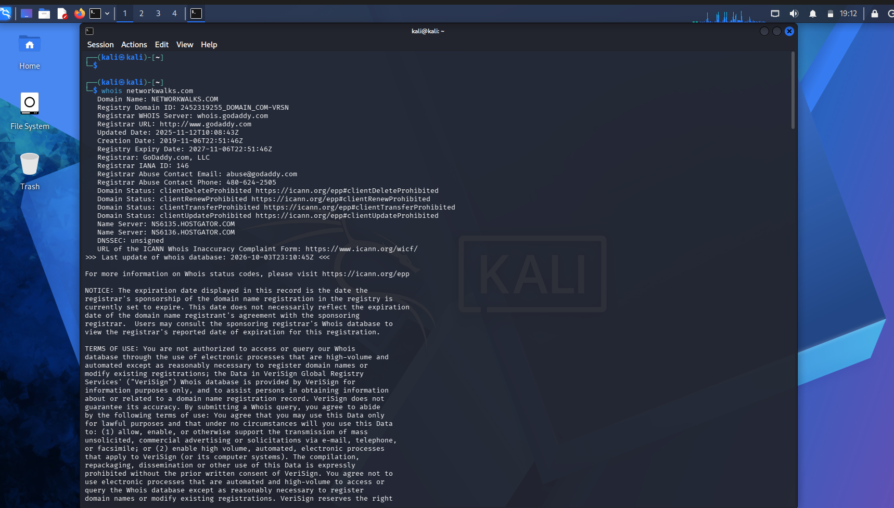
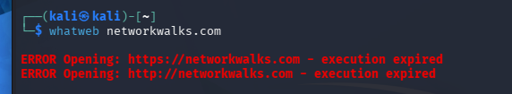
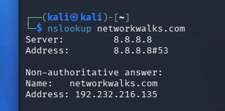
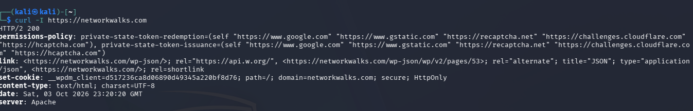
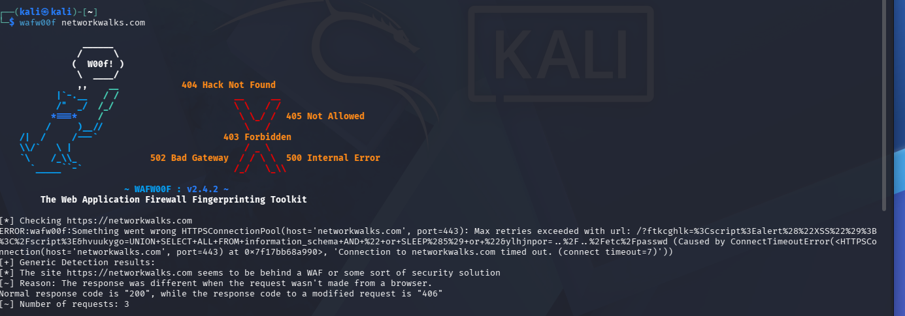
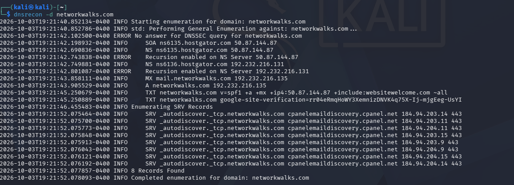
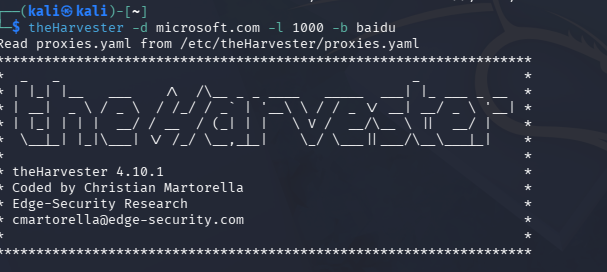
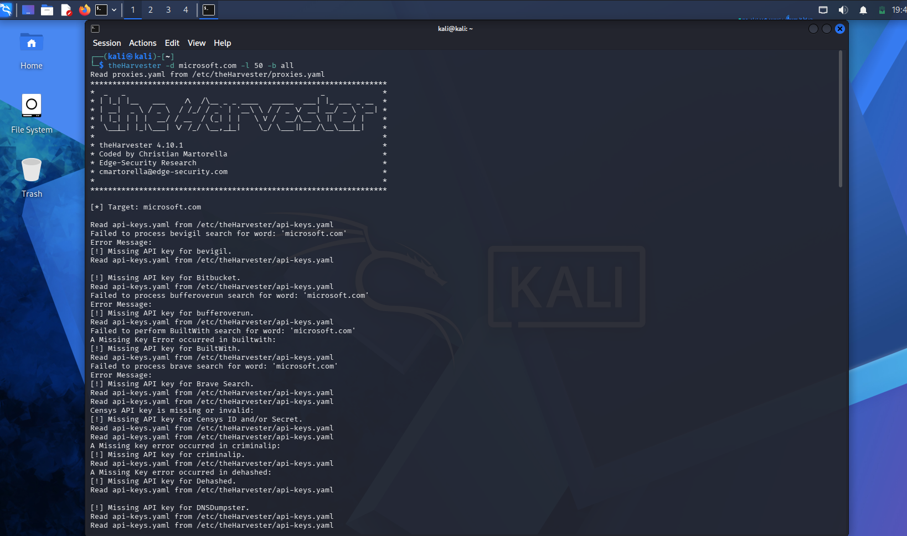

# Week 2 — Footprinting & Reconnaissance with Kali Linux Tools

This is Week 2 of my Cybersecurity & Ethical Hacking internship with NetworkWalks. Where Week 1 was mostly about getting the lab itself working, this week was the first time I actually used it for something — footprinting a real domain and doing some OSINT gathering with theHarvester.

Two modules are covered here:

- **PM1** — footprinting `networkwalks.com` using six built-in Kali tools: whois, whatweb, nslookup, curl, wafw00f, dnsrecon.
- **PM4** — gathering emails and subdomains for `microsoft.com` using theHarvester, with two different source/limit combinations.

**Author:** Sayan Samanta
**Batch:** B083, NetworkWalks

A quick note on scope before anything else — everything below was run against `networkwalks.com`, which is the training domain provided for this exercise, and the theHarvester tasks only query public search engines/OSINT sources for `microsoft.com` rather than touching their infrastructure directly. Nothing here goes beyond passive, read-only information gathering.

---

## Why this matters

Before this week I kind of understood footprinting as a concept in theory, but running it myself made it click. None of these six tools actually touch the target in any intrusive way — they just read information that's already public. whois tells you who owns a domain and where it's hosted. nslookup and dnsrecon map out the DNS side of things. whatweb and curl fingerprint exactly what software is running. wafw00f checks if there's a firewall watching. Put together, an attacker builds a surprisingly complete picture of a target without the target ever knowing it's being looked at — which is exactly why this phase is so hard to detect and so useful to defenders too, since you can run the same tools on yourself to see what you're leaking.

---

## PM1 — Footprinting networkwalks.com

### Task 1 — whois

```
whois networkwalks.com
```

This pulls back the domain registration record — registrar, creation/expiry dates, and name servers. In my case it came back pointing to GoDaddy as registrar and HostGator name servers (`NS6135.HOSTGATOR.COM`, `NS6136.HOSTGATOR.COM`), which immediately tells you who's hosting the site before you've touched the server itself.



### Task 2 — whatweb

```
whatweb networkwalks.com
```

This one didn't go smoothly on the first try — more on that in the problems section below.



### Task 3 — nslookup

```
nslookup networkwalks.com
```

Resolved cleanly to `192.232.216.135` using Google's DNS (`8.8.8.8`). Simple but important step — everything after this depends on having the right IP.



### Task 4 — curl -I

```
curl -I https://networkwalks.com
```

This just grabs the HTTP response headers without pulling the whole page. Got back a `HTTP/2 200`, saw the server was Apache, and noticed a `link` header pointing at `/wp-json/` — which gives away that the site is running WordPress and exposes its REST API endpoint, before you've even looked at the actual page.



### Task 5 — wafw00f

```
wafw00f networkwalks.com
```

Checks whether a Web Application Firewall is sitting in front of the site. My run actually hit some connection timeouts along the way (again, more on that below), but it still landed on a generic detection: the site responded differently to a normal request than to a modified one (200 vs 406), which is enough to conclude there's some kind of WAF or security layer in front of it, even without pinning down exactly which product.



### Task 6 — dnsrecon

```
dnsrecon -d networkwalks.com
```

This was the most thorough one — full DNS enumeration. Picked up the SOA and NS records, flagged that recursion was enabled on both name servers, found the MX record, the SPF/TXT records, and eight SRV records tied to cPanel email autodiscovery. A lot of infrastructure detail from one command.



---

## PM4 — OSINT with theHarvester (microsoft.com)

### Task 1 — Baidu source, limit 1000

```
theHarvester -d microsoft.com -l 1000 -b baidu
```

Queried Baidu specifically as the data source with a result limit of 1000.



### Task 2 — All sources, limit 50

```
theHarvester -d microsoft.com -l 50 -b all
```

This one was interesting mostly because of how many sources it tried and how many of them immediately failed — which again, I've written up properly below because it's worth understanding rather than just screenshotting past it.



---

## Problems I ran into (and what they actually meant)

### Problem 1 — whatweb gave "execution expired" on networkwalks.com

My first run of `whatweb networkwalks.com` just failed outright:

```
ERROR Opening: https://networkwalks.com - execution expired
ERROR Opening: http://networkwalks.com - execution expired
```

At first I assumed something was wrong with my Kali setup or my network connection, since whatweb normally returns a full breakdown of the site's stack. Turns out this is a timeout — whatweb gives the target a fixed window to respond, and if the site (or whatever's in front of it, like a WAF) is slow to respond to an automated, non-browser-looking request, whatweb just gives up and reports it as expired rather than hanging indefinitely. Re-running it a bit later worked fine and returned the expected WordPress/Bootstrap/Apache fingerprint. Lesson here: a failed scan isn't always a broken tool — sometimes it's the target itself being slow or picky about how the request looks.

### Problem 2 — wafw00f hit connection timeouts but still worked

Similar story with wafw00f. The output showed an actual connection error midway through:

```
ERROR:wafw00f:Something went wrong HTTPSConnectionPool(host='networkwalks.com', port=443): Max retries exceeded ... ConnectTimeoutError
```

This happened while wafw00f was sending one of its deliberately malformed/attack-looking test requests (you can see it's throwing things like a fake XSS payload and a SQL injection string at the URL to see how the server reacts). My first read was "okay, this crashed." But it kept going and still produced a result:

```
[+] Generic Detection results:
[*] The site https://networkwalks.com seems to be behind a WAF or some sort of security solution
[~] Reason: The response was different when the request wasn't made from a browser.
[~] Reason: Normal response code is "200", while the response code to a modified request is "406"
```

So the timeout on that one specific malicious-looking request was actually evidence in itself — it strongly suggests the WAF is specifically blocking or dropping suspicious-looking traffic at the network level (hence the hang), rather than returning a clean rejection every time. wafw00f's generic detection logic picked up on the status code difference regardless and still correctly flagged that a WAF was present, just without naming the exact product this time.

### Problem 3 — theHarvester with "-b all" mostly returned "Missing API key" errors

This was the biggest one. Running:

```
theHarvester -d microsoft.com -l 50 -b all
```

produced page after page of errors like:

```
[!] Missing API key for bevigil.
[!] Missing API key for Bitbucket.
[!] Missing API key for bufferoverun.
[!] Missing API key for BuiltWith.
[!] Missing API key for Brave Search.
[!] Missing API key for criminalip.
[!] Missing API key for Dehashed.
[!] Missing API key for DNSDumpster.
```

and this list kept going for most of the "all sources" list. I initially thought I'd broken something during install, but reading into it, this is completely expected out of the box: theHarvester only ships with free, keyless sources enabled by default (things like Baidu, DuckDuckGo, crt.sh, that sort of thing), while a lot of the more powerful sources — Shodan-adjacent tools, breach databases, commercial OSINT APIs — need you to register for your own API key and drop it into `/etc/theHarvester/api-keys.yaml` before they'll work. Running with `-b all` just surfaces every source it knows about and tells you honestly which ones it couldn't use. So for this task, the Baidu-only run (Task 1) actually returned more usable signal than the "all sources" run did, simply because Baidu doesn't require a key and most of the others in the "all" list do.

---

## What I actually took away from this week

- **Passive recon really doesn't touch the target.** Every tool here just reads public information or sends normal-looking requests — nothing here would show up as an attack in a log the way a scan or exploit attempt would.
- **A tool failing isn't always your fault.** Both the whatweb timeout and the wafw00f connection error looked like broken setups at first, but they were actually the target (or its WAF) behaving a certain way — which is itself information.
- **"All sources" doesn't mean "all working."** theHarvester happily tells you which sources it can't use without an API key rather than silently skipping them, which is actually useful once you understand what you're looking at.
- **Small details add up fast.** A `/wp-json/` link header, a WordPress version number, a WAF fingerprint, and a handful of DNS records don't individually seem like much, but stacked together they give a surprisingly complete profile of a target before you've run a single scan against it.
- **This is also exactly how defenders audit themselves** — running these same six tools against your own domain tells you what an attacker would see on day one, which is a pretty direct way to figure out what you're leaking.

---

## Tools used

- whois, whatweb, nslookup, curl, wafw00f, dnsrecon (all pre-installed on Kali Linux)
- theHarvester 4.10.1 (pre-installed on Kali Linux)

---

**Sayan Samanta** — Batch B083, NetworkWalks Cybersecurity Program
